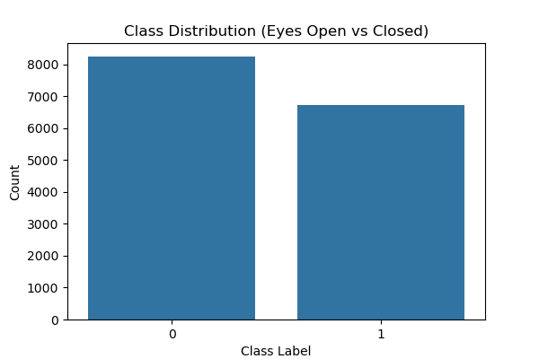
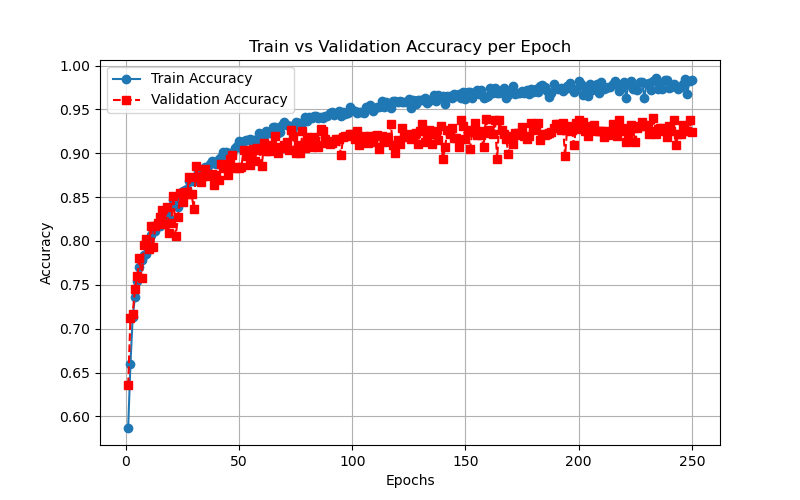

# RobustEEGClassifier: EEG Classification with Residual Blocks

## Overview
This project focuses on EEG classification using deep learning models. Various architectures were explored, including simple MLPs, CNN-based EEGNet, LSTMs, and residual MLPs. The final model chosen was `RobustEEGClassifier`, which leverages residual blocks to improve feature learning and stability.

## Dataset
The dataset used is **EEG Eye State**, provided in ARFF format. It contains 14 EEG channel readings and a binary classification label indicating whether the subject's eyes were open or closed.

### Preprocessing
- Data is read from `eeg+eye+state/EEG Eye State.arff`.
- Standard scaling is applied to the EEG channel values.
- The dataset is split into training, validation, and test sets (80-10-10 ratio).
- Data is loaded using `torch.utils.data.DataLoader`.

### Dataset Visualization
To better understand the data, the following visualizations were added:
- **Class Distribution:** A bar plot showing the number of samples per class (eyes open vs. closed).  
  
- **EEG Channel Correlation Matrix:** A heatmap displaying correlations between different EEG channels.  
  

## Model Architectures Explored
Several models were implemented and tested:

### 1. **EEGClassifier (MLP)**
- A simple feedforward network with batch normalization and dropout.

### 2. **EEGNet (CNN-based)**
- Uses temporal and depthwise convolutions inspired by EEGNet for EEG signal processing.

### 3. **ResidualMLP**
- Incorporates skip connections to enhance gradient flow in deeper MLP architectures.

### 4. **EEG_LSTM**
- Uses LSTMs to capture temporal dependencies in EEG signals.

### 5. **RobustEEGClassifier (Final Choice)**
- Based on residual MLP architecture with Layer Normalization.
- Stacks multiple `ResidualBlock` layers for better feature representation.
- Introduces a dropout mechanism to reduce overfitting.

## Training
The training process was implemented in `train_tqdm.py`, which:
- Uses `CrossEntropyLoss` as the loss function.
- Optimizes the model using the Adam optimizer with a learning rate of `0.0021`.
- Monitors progress using `tqdm` for better visualization.

### Training Parameters
- `num_epochs = 200`
- `batch_size = 64`
- `learning_rate = 0.0021`
- `weight_decay = 1e-4`

## Evaluation
The evaluation function computes:
- Test loss
- Accuracy

The trained `RobustEEGClassifier` achieved good classification accuracy, outperforming other models tested.

### Post-Training Visualization
To analyze model performance, the following plots were added:
- **Training Loss & Accuracy Curve:** Plots loss and accuracy over epochs to detect overfitting.  
  
- **Train vs Validation Accuracy Curve:** Compares train and validation accuracy per epoch to check for overfitting.  
  
- **Confusion Matrix:** Visualizes the classification performance.  
  
- **ROC Curve:** Evaluates performance, especially for imbalanced datasets.  
  
- **Feature Importance (SHAP or Permutation Importance):** Highlights influential EEG channels.  
  

## Running Visualizations
After training, the following script can be used to generate visualizations:
```python
from visualization import plot_training_curves, plot_training_vs_validation_accuracy, plot_confusion_matrix, plot_roc_curve, plot_feature_importance

# Assuming you stored training loss & accuracy per epoch
plot_training_curves(train_losses, train_accuracies)
plot_training_vs_validation_accuracy(train_accuracies, val_accuracies)

# Get predictions
y_true, y_pred, y_scores = [], [], []
model.eval()
with torch.no_grad():
    for data, target in test_loader:
        data, target = data.to(device), target.to(device)
        output = model(data)
        _, predicted = torch.max(output, 1)
        y_true.extend(target.cpu().numpy())
        y_pred.extend(predicted.cpu().numpy())
        y_scores.extend(torch.softmax(output, dim=1)[:, 1].cpu().numpy())  # Probabilities for class 1

# Plot confusion matrix & ROC Curve
plot_confusion_matrix(y_true, y_pred)
plot_roc_curve(y_true, y_scores)

# Feature importance
plot_feature_importance(model, test_loader)
```

## Future Work
- **Hyperparameter Tuning:** Experiment with different architectures and dropout rates.
- **Deployment:** Package the trained model for real-world EEG classification applications.

## Running the Code
To train and evaluate the model, run:
```bash
python main.py
```
Ensure that all dependencies are installed before execution.

---

This `README.md` will be updated later to include visualization elements.

